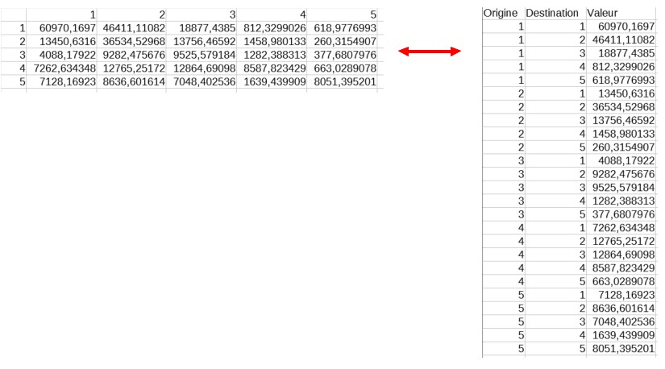

# matrice
Convertisseur de matrice CSV

Cet utilitaire permet de convertir très simplement et en quelques clics, une matrice (tableau à double entrée) vers un tableau à 3 colonnes et vice-versa.

"Convertisseur de matrices" est un utilitaire qui a été développé en 2009 au sein du laboratoire ESO-Rennes (UMR 6590 CNRS à l'Université Rennes 2) par Isabelle Brémond (Ingénieur d'étude en informatique) en réponse à un besoin exprimé dans le cadre d'un programme financé par l'ANR METAL (Métropoles d'Amérique latine dans la mondialisation : reconfigurations territoriales, mobilité spatiale, action publique, piloté par Françoise Dureau). Il comble ainsi un manque dans la mesure où aucun utilitaire équivalent aussi facile d'emploi n'existait à l'époque. Les tableaux ainsi formatés en 3 colonnes peuvent servir de fichiers d’entrée au "calculateur de voisinage", présenté ci-dessous.

"Convertisseur de matrices" est un logiciel gratuit fonctionnant sous Windows (XP et Vista et Windows 7 et a priori sous Windows 8, mais nous n'avons pas testé). Vous pouvez le télécharger et l'utiliser librement. Nous vous demandons simplement de citer « Convertisseur de matrices - Laboratoire ESO-Rennes - UMR 6590 CNRS - Université Rennes 2 » si vous publiez des travaux dans lesquels vous l'utilisez. Si vous souhaitez optimiser cet utilitaire, ou obtenir de plus amples renseignements sur le code source de l'application, veuillez contacter Isabelle Brémond (Isabelle.bremond@univ-rennes2.fr).

